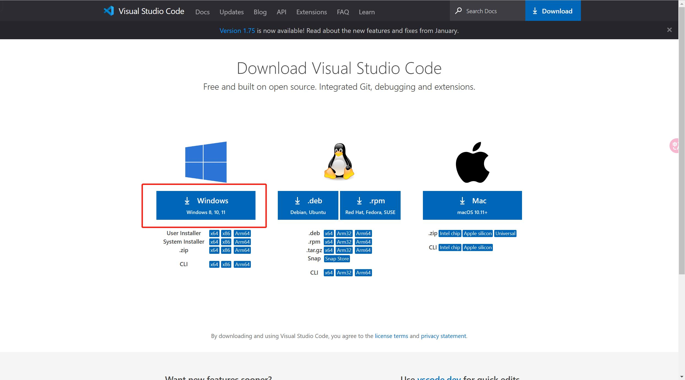
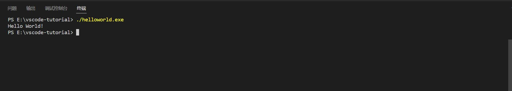
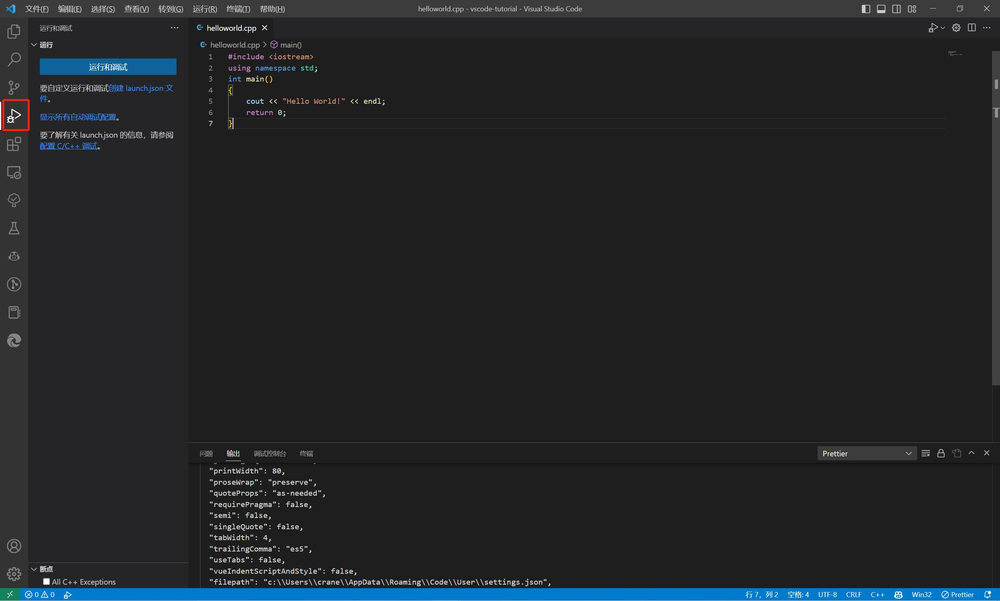

# 用vscode优雅配置c/c++环境！

> **写在前面：** 本文的写作动机很简单，在水22级新生群时，发现还是有很多学弟学妹在问关于怎么用 vscode 作为写代码的工具。作为 c/c++ 的《启蒙》课程，计算概论(A)这样一门类似于专业课的公共基础课对小白却并不友好。计概A这门课推荐大家使用 Visual Studio 作为写代码的工具。但结合这门课的内容，我认为 VS 并不算是一个合适的 IDE，至少教学组推荐它，一是照顾小白，二是想偷懒（后者纯属瞎猜），但 VS 确实给当时的我留下了很不好的印象。也许在安装、配置环境的时候，VS 更加省事，但这时候逃的课，终究要在日后与代码打持久战的时候补回来。笔者这里出一个使用 vscode 优雅配置 c/c++ 的教程，一是给小白和新生们指明道路，二是心疼过去在这方面摸爬滚打的自己，不希望有更多人掉进这个坑里。  
>
> 当然还有个原因，目前网络上的一些教程偏旧，gcc 版本还停留在 8.1.0，而目前最新的 gcc 版本早已来到 12.2.0，很有更新的必要。

> 关于引言中的一些关键点，我会在教程结束后，补充说明，目前还是以正题为主，配置 vscode！

[TOC]

---


## 1.原理

> 如果不想看本部分，请直接跳转到[2.开始](#2.开始！主角准备！)，但我强烈推荐你看完这部分，之后也能按照这个思路解决vscode配置中的一些问题。毕竟，知其表里，才是一劳永逸解决问题的关键。  

**vscode** 到底是什么？ 问起很多人，却感到这中间误解颇深，很多人觉得它是一款编译器，也有一些人觉得它是一款轻量的IDE。 


 

确切地说，**vscode** 只是一款文本编辑器，它和你电脑上的记事本并没有什么两样，~~甚至 word 也是~~。但 **vscode** 强大之处在于，也许你在马路上看到的是两辆车在疾驰，但其中一辆开着开着突然变身，这时你才发现，原来我一直把它当普通的汽车来看，没想到竟然是变形金刚！而 **vscode** ，就是一个功能强大的变形金刚。可扩展性强是它最大的优势，你可以让 vscode 变成任何你想要的形状，甚至是你的形状（  


那既然只是一款文本编辑器，为什么 vscode 可以用作c/c++，甚至是一切语言的开发环境呢？  

- vscode 集成了终端系统，可以在其内部调用命令行终端，而命令行终端可以完成将代码变成程序这个任务。（这里为简洁易懂，有部分不严谨，但是是对的。）
- vscode 可以设置一些选项，使得能在上条中提到的命令行终端中执行一套命令，调用语言编译器对代码进行编译等，变成程序。
- vscode 可以装一些对应语言的插件，使得开发环境更加完善。  


所以，我们接下来要做的任务，就是使得 vscode 能调用编译器，完成对代码的编译和运行。  


## 2.开始！主角准备！

### 2.1.下载 vscode

> 本文主角，无可争议。

在 bing ~~《小 心 百 度》~~ 上搜索 vscode，点进[官方网站](https://code.visualstudio.com)


进来后，点击右上角的[Download](https://code.visualstudio.com/Download)


点击Windows即可下载



### 2.2.安装vscode

打开刚才下载的 *VSCodeUserSetup-x64.exe* 文件，将选项全部选中


笔者电脑中当前用户下已有 vscode，如果是新用户，在此之前会有选择安装路径这一步，我 **强烈建议** 将 vscode **安装在其他盘** ，并且 **路径中不要有中文and空格** 。

> 我见过好多同学电脑中C盘爆红D盘白白净净的情况了，就是无脑安装造成的。

上面说的只是一个原因，另一个原因是如果你在刚买来电脑的时候，不小心给用户起了一个中文名，又或者名字中带了空格，那对于不能解析中文路径的某些软件包来说是致命的（巧了，本文就有个东西和这玩意有很大的关系）。至少，你不太想重装系统，如果也不想新建用户的话，就只能尽量避免之前的一步错造成之后的步步错了。


至此，vscode 的安装就完成了！这时如果你电脑上没有其他任务，可以重启一下，让某些设置项更新，方便之后的配置。


## 3.幕后老板——编译器准备！

目前主流的 C/C++ 编译器，Linux平台有 `gcc` ，Windows平台有 `msvc` ，MacOS 平台有 `clang` ，但我们选用 `gcc` 作为编译器。

> `gcc` 是在vscode上最为主流的配置，也是我个人推荐的一种配置。 msvc 不推荐用于 `vscode` ，毕竟我的尝试是以找不到头文件而失败告终的×。而 `gcc` 经历了历史的洗礼和开源社区的贡献，现在也十分成熟了。  
>
> 另一个原因是，目前主流的 onlinejudge (在线代码评测系统)对 C/C++ 语言的支持，也是用 gcc。这位朋友，你也不希望用着 msvc 的你的代码本地过了， oj 上不过吧（不过目前的 gcc 开发那边确实是有点摆烂（逃  
>
> 但笔者也说了， gcc 是 Linux 平台的，怎么用于 Windows 呢？

我们需要用到 MinGW-w64 ，全名 Minimalist GNU for Windows，是 Linux 平台上的一套开发工具，移植到 Windows 平台。这之中，就有我们需要的 gcc。

> 其实MinGW很早就不更新了，后来被接管，开发出了MinGW-w64，也是现在用的最多的一个分支。（可能不太严谨）


如果你可以浏览外网（GitHub），那么可以跟着我的步骤一步一步来下载 MinGW-w64，否则我就[帮人帮到底](https://disk.pku.edu.cn:443/link/D6308A978172655418143816A12CD712)，同时你可以跳过下面的步骤1，直接来到[安装](#3.2.安装)。  


### 3.1.下载MinGW-w64

要不这部分先咕咕咕吧，直接用上边的蓝色链接进北大网盘，就可以下载了，速度也很感人，是真的很感人！


zip和7z都可以，东西是一样的，7z很小，但万一电脑没有解压缩软件就寄了，就只能下zip了  

这里也贴出[Github链接](https://github.com/niXman/mingw-builds-binaries/releases)，如下图


建议下载红框内的ucrt版本。

> `u` 是 universal，通用的意思，`crt` 是 c++ runtime，运行时环境。


### 3.2.安装

不管你通过何种方式得到了 *x86_64-12.2.0-release-posix-seh-ucrt-rt_v10-rev2.7z或.zip* 这个压缩包，现在请把它解压到除了C盘以外，不带中文路径不带空格的一片地方，与 vscode 的要求相同。  

> 同样是为了防止某些奇怪的问题，很不巧，gcc 和中文路径是死敌，所以……  

为接下来叙述方便，我会假定你装在了E盘的根目录下，即E盘下有一个 mingw64 文件夹。  

下一步是设置path环境变量。将E:/mingw64/bin添加到path环境变量中，可以参考这篇[教程]([mingw64安装和path环境变量配置教程_mingw64 path环境变量_山水:的博客-CSDN博客](https://blog.csdn.net/woxingzou/article/details/113746142)),我就不再过多赘述了。  

如果在终端中能够输入 `gcc --version` 并且不报错，就配置好了。  

> 如果在这里有问题，请在 Q&A 中寻找符合自己的情况。


## 4.配置vscode

### 4.1.扩展支持

> 扩展可以让你的 vscode 更舒服，且并不是必选项，没有扩展，同样可以让代码跑起来，但扩展很建议非常建议。

- 简体中文插件，必备。

- `C/C++` 提供了丰富的对C/C++语言的支持，包括单步调试，头文件寻找等等。

- `Better C++ Syntax` 很著名的一款C++语法高亮插件，护眼必备。

  > **语法高亮** ：可以将变量、函数名、关键字等染上不同的颜色，方便阅读代码。

- `Rainbow Brackets` ，可爱的彩虹括号扩展，现已内置于 vscode 中，无需额外下载，写在这里是为了表达我对彩虹括号的深切喜爱×


### 4.2.扩展下载

> 很简单，`Ctrl+Shift+X`然后搜索扩展下载就可以了


### 4.3.配置C++环境

C++环境需要 .vscode 文件夹下的 *c_cpp_properties.json,tasks.json,launch.json* 这三个文件共同定义。

- **c_cpp_properties.json** ：对C/C++扩展的设置。
- **tasks.json** ：定义如何生成可执行文件。
- **launch.json** ：定义如何调试可执行文件。

#### 4.3.1.tasks.json

首先选择一个文件夹，右键用 vscode 打开，这个文件夹就作为之后写 c++ 的文件夹，如果想用其他文件夹，后文会说。  

如果你这时候在目录下新建一个 `helloworld.cpp` 文件，写好了 `helloworld` ，摁下 `Ctrl+F5` ，这时会让你选择这个  


选择 g++.exe` ，会在当前文件夹的 .vscode 文件夹下生成一个 *tasks.json* 文件

```json
{
    "tasks": [
        {
            "type": "cppbuild",
            "label": "C/C++: g++.exe 生成活动文件",
            "command": "E:\\mingw64\\bin\\g++.exe",
            "args": [
                "-fdiagnostics-color=always",
                "-g",
                "${file}",
                "-o",
                "${fileDirname}\\${fileBasenameNoExtension}.exe"
            ],
            "options": {
                "cwd": "${fileDirname}"
            },
            "problemMatcher": [
                "$gcc"
            ],
            "group": {
                "kind": "build",
                "isDefault": true
            },
            "detail": "调试器生成的任务。"
        }
    ],
    "version": "2.0.0"
}
```

这段代码定义了 vscode 以怎样的方式调用 gcc 编译器将代码编译成可执行文件。   

你也可以 `F1` 之后输入 task ，选择配置默认生成任务，就会生成 tasks.json   


如果你按照[3.2安装](#3.2.安装)配置了 PATH 环境变量，那生成的 tasks 文件中，“command” 标签中的路径应该是和上面的一样。

> 前文说过，为了叙述方便，我默认你将 mingw 装在了E盘根目录下，其他的也一样，改过来就可以

 

如果一切顺利，你应该可以看到文件夹下生成了一个 *helloworld.exe* 文件。  

在vscode中Ctrl+\`，可以打开终端，输入`./helloworld.exe`，可以发现确实输出了Hello World！   



摁一下 `Ctrl+F5` ，可能会出现一闪而过的黑窗口，或者是像上面一样在终端出现了Hello World！那就是正常的。


不那么顺利的话，或者顺利的话，都请跟着继续吧。  


#### 4.3.2.launch.json




点击这个甲壳虫小三角，然后点击 *创建launch.json文件* ，选择 GDB ，会生成一个空的 *launch.json* 文件。  


配置的选项可以在[这里](https://go.microsoft.com/fwlink/?linkid=830387)找到，我直接贴在下面

```json
{
    "version": "0.2.0",
    "configurations": [
        {
            "name": "g++.exe - Build and debug active file",
            "type": "cppdbg",
            "request": "launch",
            "program": "${fileDirname}\\${fileBasenameNoExtension}.exe",
            "args": [],
            "stopAtEntry": false,
            "cwd": "${fileDirname}",
            "environment": [],
            "externalConsole": false,
            "MIMode": "gdb",
            "miDebuggerPath": "E:\\mingw64\\bin\\gdb.exe",
            "setupCommands": [
                {
                    "description": "Enable pretty-printing for gdb",
                    "text": "-enable-pretty-printing",
                    "ignoreFailures": true
                }
            ],
            "preLaunchTask": "C/C++: g++.exe 生成活动文件"
        }
    ]
}
```

这里说几个重要的选项

- **externalConsole** ：这个配置表明是否启动控制台， true 会出现额外的黑窗口， false 则会调用内置终端。由于黑窗口运行完之后会直接关闭，不利于查看运行结果，所以推荐设为 false ，这样就可以在终端中看到结果了，类似于[4.3.1](#4.3.1.tasks.json)中的图2。

- **miDebuggerPath** ：调试器的路径。我们用 gdb 作为调试器，所以路径为mingw64/bin/gdb.exe

- **preLaunchTask** ：前置运行任务，这里要和 tasks.json 里边的 label 属性一样。

  > 因为调试前需要先编译出可执行文件，所以这里需要调用编译可执行文件的配置，先去执行编译任务，再进行debug。
  >
  > 也就是会先去调用前面的 tasks.json 里边定义的任务，生成一个 .exe 的文件。

这样，打一个断点，然后摁下 `F5` ，你就可以在断点处停下来看具体的信息了！

#### 4.3.3.c_cpp_properties.json

  这玩意可以在设置里设置，也可以自动生成 json 文件

> 方法：`F1->输入c/c++`，选择C/C++:编辑配置(JSON)，会在.vscode下生成一个 *c_cpp_properties.json* 文件

```json
{
    "configurations": [
        {
            "name": "Win32",
            "includePath": [
                "${workspaceFolder}/**"
            ],
            "defines": [
                "_DEBUG",
                "UNICODE",
                "_UNICODE"
            ],
            "compilerPath": "E:\\mingw64\\bin\\gcc.exe",
            "intelliSenseMode": "windows-gcc-x64",
            //以下两条或许不会默认生成，但我建议你添加上
            "cppStandard": "c++23",
            "cStandard": "c23"
        }
    ],
    "version": 4
}
```

解释一下我认为其中比较 **重要** 的选项：  

- **includePath** ：头文件的位置，这里的${workspaceFolder}/**，”/“前为一个vscode变量，值为工作区路径（工作区就是你当前打开的文件夹），”/“后的”\*\*“的意思是递归向下寻找。如果你需要安装c++第三方库，请看后面的Q&A。头文件库默认包含了c++标准库，无需指定。
- **compilepath** ：编译器路径，c++扩展会从 path 环境变量中自动寻找 gcc 的路径，如果这个路径找不到，请手动设置。
- **intelliSenseMode** ：选择当前的平台和编译器，我们是在 windows 平台上使用 gcc 作为编译器，所以填windows-gcc-x64。
- **cppStandard** & **cStandard** ：指定c和c++标准。为了不影响代码编写（指某些奇怪的红色波浪线），同时享受新标准的便利，请至少设为 `c++17` 或以上和 `c11` 以上。我们所用的 gcc 12.2.0 已经部分支持 c++23 和 c++20 。

> 以上的这些选项，也可以在设置->C/C++中寻找相同的选项进行配置，我觉得会更加友好。


#### 4.3.4.settings.json

> 这个是当你修改了工作区设置之后，会产生这样一个文件。它对于本篇教程并没有什么重要之处，所以本篇暂不涉及。


到目前为止，我们的vscode已经可以比较好的支持我们对c++的编写了！


下面是一些QA

## 5.Q&A

- Q：你为什么不推荐用 Visual Studio 或者说用 msvc 作为c++编译器?

- A：首先，这句话是对正在学习C语言或者正在 PKU 学习计算概论A这门课的过程中学习“C++”的同学说的。msvc 是一个C++编译器，而不是C编译器，对于C的支持非常有限。对于正在学习C语言的同学们，你们一定不想看到很多教程上的 `scanf` 到你这里确是报错，让你换上更安全的 `scanf_s`，然后提交到 online judge 上发现 oj 又报一遍错。这只是一个小小的缩影，msvc 上很多东西是不可移植的，这会带来很多学习上的困扰；其次是对于正在 PKU 学习计算概论这门课的同学们，你们学习的“C++”其实只是 C & `cin` & `cout` ，所以和我上面提到的学习C语言的同学们并没有什么区别。而且，VS 在做C++项目上有很大优势，但每次写 oj 题只是用单文件，大炮打蚊子这种事儿，至少对于每次都要新建一个 VS 项目的你，并不是最优解。

- Q：那你说不推荐 msvc ， gcc 有什么好处呢？  

- A：首先，我上面提到的 msvc 对于教学过程中的劣势，都可以看作是 gcc 的优势。当然，单文件这件事并不算是一个编译器的优势，但可移植性上，gcc 比 msvc 做的好一点。还有更重要的是，不仅仅是目前C语言的学习，后面还有更多的课程，比如说计算机系统导论（Introduction to Computer System），会让你使用 gdb 、 gcc 等一套 linux 上的工具链去学习，这是 msvc 无法完成的。说白了，随着学习和教学走，就可以了。这俩的关系，其实有点像 pytorch 和 tensorflow 。

- Q：为什么是 vscode？其他的可以吗？  

- A：正如我前面所说，vscode 本质上只是一个有着终端，有很多接口的文本编辑器。那么，只要你愿意， word 也可以拿来写代码（不尬黑，上学期在图书馆真的见到有哥们在用 word 写 python 打 codeforce），但 vscode 可扩展性强，并且轻量。如果不是为了用的舒服，我会很推荐你用 Dev-Cpp，真正的开箱即用，但磨刀不误砍柴工嘛，谁不想拥有一个舒适的环境呢！   

  除了 vscode，还有一些代码编辑器，比如 vim，sublime 等等，也可以装插件达到写代码并跑起来的效果，但 windows 平台，目前，最好的应该还是 vscode 了。  

- Q：PATH 环境变量是什么？我为什么要设置他？  

- A：PATH 环境变量我觉得可以理解成这样：  

  假如你有一个大房间，里面摆满了你的私人物品，玩具、书、纸笔、作业本等等。但有一些东西是你经常要用的，比如书、纸笔、作业等，你不希望每次都进这个大房间到处翻腾寻找这些东西，这时你有两个选择：  

  - 把这些东西放在房间外面一个比较显眼的地方，这样就不会忘了他在哪，并且很容易找到
  - 用一个小本本记下来这些东西具体在哪里，每次先查一查东西在哪里，然后再去查找

  而设置 PATH 环境变量这件事，实际上就是在搞第二件工作，把你要用的东西用小本本记下来，让系统去找。   

- Q：我没法上去那个 GitHub 网站，怎么办啊？

- A：这是不能说的秘密，我建议你去[这个网站](https://csdiy.wiki)查阅程序员必学工具的第二项，本教程不提供相关。

- Q：我跟着配置了，路径也没有问题，为什么提示我找不到编译器呢？

- A：gcc 和中文路径是死敌，无论是 mingw 的位置，还是你打算写代码的位置，都不要有中文和空格，否则会报错。还有一个原因就是你在写路径的时候用了"\\"，这是老问题了，这里可以参考[这篇文章](https://blog.csdn.net/weixin_44441131/article/details/108063263)，建议全部改成“/”。

- Q：有的头文件找不到怎么办？

- A：如果是`<bits/stdc++.h>`找不到，那可以先试试 `<iostream>` ，如果也不行，那直接重装 mingw ，如果可以，，，那同样建议重装。这个是开箱即用的（  

  如果是其他的，那请参照下面一条 Q&A！
  
- Q：我想装一些另外的库，比如说 opencv 、opengl等等，应该怎么办？

- A：请期待我的下一篇教程吧！毕竟，本教程只是为了让大家能够配置好基础的C/C++环境。（挖个坑先）

  
  
  

那么，本教程到这里就结束啦！祝大家都能顺利配好C/C++环境！
